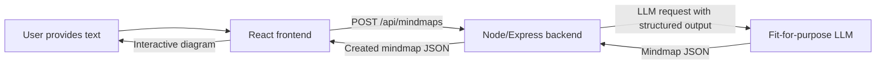

# 🧠 Visualli AI Challenge: "Mini Mindmap"

> [!NOTE]
> Please commit your work at each logical milestone. We want to see how your
> solution evolves over time, not one large final commit or push. A clean series
> of commits for each working version is strongly preferred.

## 🌍 Context & Problem Statement

Welcome to the **Visualli AI Challenge**. This exercise is a very scaled-down
version of what Visualli does in production: turn any content into an interactive
visuals.

This challenge is primarily intended to evaluate your **AI Engineering** skills,
while still touching the basics of **Backend** and **Frontend engineering**.

### A Few Things to Note
- A complete submission should touch all three parts. 
- Budget roughly **4-6 hours** for the core requirements. 
- Stretch goals are optional and only matter as tie-breakers. 
- A clean, well-tested core submission is stronger than a rushed stretch goal.

## ✨ Exercise Summary

In short, you are expected to:

- build a small full-stack app that turns raw text into a mindmap
- use an LLM to generate structured data, then validate it strictly
- expose the flow through a simple backend API
- render the result as an interactive diagram in React

## 🛠️ What You're Building

Build a small full-stack app with one main user flow:

1. A user pastes a block of text into a textarea and clicks "Generate."
2. The backend sends that text to an LLM and receives a structured mindmap in
   return.
3. The frontend renders that result as an interactive node-link diagram, not as
   a bullet list.
4. When the user clicks a node, the UI shows that node's summary.

Examples of acceptable input: an article, a blog post, meeting notes, or any
other block of prose.



## 📐 The Data Contract

The AI layer and the frontend must agree on a single response shape. Treat this
as a strict contract.

```ts
type MindmapNode = {
  id: string; // stable and unique within the mindmap
  label: string; // 1-4 words
  summary: string; // one sentence
};

type MindmapConnection = {
  from: string; // node id
  to: string; // node id
  label: string; // relationship label, e.g. "causes" or "part of"
};

type Mindmap = {
  title: string;
  rootId: string; // must match one node's id
  nodes: MindmapNode[]; // 5-9 nodes total, including the root
  connections: MindmapConnection[];
};
```

Your generator must enforce the following constraints. LLMs do not reliably
follow instructions, so your code must be the backstop:

- The mindmap contains at least **5 to 9 nodes** total, including the root node.
- `rootId` matches a real node id.
- Every `from` and `to` value in `connections` references a real node id. No
  dangling edges.
- Node ids are unique.
- If the LLM response does not parse or fails validation, **retry once** with a
  corrective prompt before giving up and returning a clear error to the client.

## 🤖 Part 1 - AI Engineering

Implement a function in either Python or Node with this signature:

```ts
generateMindmap(text: string) => Mindmap
```

Requirements:

- **🔌 LLM provider:** Call a real LLM API of your choice. Use an LLM that fits to the purpose / whichever provider you already have access to.
- **🧾 Structured output:** Use **structured output / JSON mode**. Do not rely on plain-text prompting like "please respond with JSON" and then manually parse free-form text.
- **✅ Validation:** Validate the raw model output against the schema above before it reaches the API layer. Pydantic, Zod, or an equivalent library is fine.
- **⚠️ Edge cases:** Handle the following cases:
  - empty input
  - input that is too short to summarize meaningfully
  - input that is long enough to raise token-limit concerns
- **🧪 Mock mode:** Support a `MOCK_MODE=true` environment variable for cases where you do not
  want to share an API key. In mock mode, return a canned but realistic
  `Mindmap` for a small set of fixture inputs. Document this clearly in the
  README.

We care more about *how* you constrain and validate model output than about the
exact wording of your prompt. Show us that you understand LLM output is
untrusted input.

## 🖥️ Part 2 - Backend (Node.js + Express)

Build a small Express API with these endpoints:

- **`POST /api/mindmaps`**
  - Request body: `{ text: string }`
  - Behavior: calls your Part 1 generator, stores the result, and returns the
    created `Mindmap` with an assigned id
- **`GET /api/mindmaps`**
  - Returns a list of previously generated mindmaps
  - `id`, `title`, and `createdAt` are enough for the list response
- **`GET /api/mindmaps/:id`**
  - Returns one stored mindmap in full

Requirements:

- **🧾 Request validation:** Validate the request body using a schema validation library of your choice.
  Missing or empty `text` should return `400` with a clear error message.
- **💾 Persistence:** Persist data somewhere that survives beyond a single request. In-memory
  storage is fine. A file, SQLite, or lowdb is a nice-to-have. MongoDB is a
  bonus if you want to mirror our actual stack, but it is not required.
- **🛡️ Error handling:** Use centralized error handling. A thrown error should not produce an
  unhandled stack trace in the response.
- **🧪 Tests:** Include at least a few Jest tests:
  - one for request validation failure
  - one for a successful create flow
  - one for the generator's schema-repair/retry logic
- **🚫 Real API calls in tests:** Mock the LLM call in tests. Do not hit a real provider in automated tests.

## 🎨 Part 3 - Frontend (React + TypeScript)

Build a single-page UI with the following behavior:

- **📝 Input area:** A textarea and submit button
- **⏳ Loading state:** A loading state while generation is in progress
- **🕸️ Diagram view:** A diagram view that renders the returned `Mindmap` as an actual node-link
  visualization
- **💬 Summary view:** A visible summary view when a node is clicked
- **📭 Empty and error states:** Clear empty and error states

Diagram requirements:

- Place the root node in the center or at the top.
- Arrange child nodes around it.
- Render labeled edges between connected nodes.
- SVG, `<canvas>`, or absolutely positioned divs are all acceptable.
- You do not need to use a canvas or diagramming library, but you may if you
  prefer.

Interaction requirements:

- Clicking a node should reveal its `summary`. A side panel, tooltip, or modal
  are all acceptable.
- Handle backend errors visibly. Do not leave them only in the console.
- Handle the empty state visibly when there are no mindmaps yet.
- Include at least one frontend test using React Testing Library or a Cypress
  component test. It can cover either layout logic or the click-to-reveal
  summary behavior.

State management, styling, and component structure are up to you. We want to
see how you organize a small React app, not whether you copied a particular
stack pattern.

## 🚀 Stretch goals (optional)

If you have time left, pick at most one or two. Depth on one is better than
breadth across several.

- **Streaming generation.** Instead of making the user wait on one blocking
  request, stream progress events from backend to frontend, for example with
  Server-Sent Events, and show incremental progress in the UI.
- **Drill-down expansion.** Clicking a node fetches or generates a child layer
  for that node only, then renders it as a nested expansion. This is the
  closest option to what our real product does.
- **Two-phase generation.** Split generation into a cheap outline pass and a
  second pass that fills in node summaries and connections. Explain why you
  chose that split in terms of cost, latency, or output quality.
- **Light/dark theme.** Drive the theme with CSS variables rather than a
  component-level toggle.

## 📊 Evaluation Criteria

Your submission will be evaluated on the following areas:

| Area | What We Look For |
| --- | --- |
| **Correctness** | A working end-to-end flow, with edge cases such as bad input, malformed LLM output, and missing node references handled gracefully |
| **Judgment around untrusted LLM output** | Validation and repair logic that treats model output as untrusted input rather than assuming it is correct |
| **Code organization** | A repository structure that another engineer can navigate without extra explanation |
| **Testing quality** | Tests that cover meaningful failure modes and behavior that could actually break |
| **Communication** | A README that explains setup, tradeoffs made under time pressure, and what you would improve with more time |

## 📦 Submission Deliverables

1. **Source code repository:** Send a public repository URL containing all components.
2. **`README.md`:** Include:
   - setup steps
   - which LLM provider you used
   - how to run the app in `MOCK_MODE` without an API key
3. **Time note:** In the README, note how long you spent and call out anything
   that is rough because you ran out of time. We would rather know that
   explicitly than guess.
