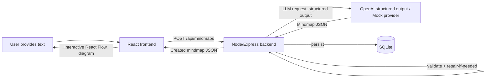

# Architecture — Visualli Mini Mindmap

> Companion to `context.md`. That file explains *what* and *why* (the challenge
> requirements); this file explains *how* the system is designed and organized.

## High-Level Flow



## Monorepo Layout

pnpm workspace with three packages: `shared`, `server`, `client`. `shared` is the
single source of truth for the `Mindmap` contract; both apps depend on it as a
workspace package so the types can never drift apart.

```
visualli-mini-mindmap/
  pnpm-workspace.yaml
  package.json
  .env.example
  .eslintrc.cjs
  .prettierrc
  README.md
  docs/
    architecture.md
  shared/
    src/
      types/mindmap.ts
      schemas/mindmap.schema.ts
      index.ts
  server/
    src/
      index.ts
      app.ts
      config/env.ts
      routes/mindmaps.routes.ts
      controllers/mindmaps.controller.ts
      services/
        mindmap.service.ts
        llm/
          llmClient.ts
          openaiProvider.ts
          mockProvider.ts
          prompts.ts
      validators/
        mindmapValidator.ts
        requestValidators.ts
      repositories/
        mindmap.repository.ts
        db.ts
      middleware/
        errorHandler.ts
        asyncHandler.ts
      utils/
        logger.ts
        tokenEstimate.ts
      fixtures/mockMindmaps.ts
    tests/
      unit/mindmapValidator.test.ts
      unit/mindmap.service.test.ts
      integration/mindmaps.routes.test.ts
  client/
    src/
      main.tsx
      App.tsx
      api/
        client.ts
        mindmaps.ts
      hooks/
        useGenerateMindmap.ts
        useMindmapsList.ts
        useMindmap.ts
      components/
        InputPanel/{InputPanel.tsx, CharacterCounter.tsx}
        Diagram/{MindmapCanvas.tsx, MindmapNodeCard.tsx, diagramLayout.ts}
        SummaryPanel/SummaryPanel.tsx
        History/HistorySidebar.tsx
        common/{LoadingSkeleton.tsx, ErrorState.tsx, EmptyState.tsx, Toast.tsx}
      state/themeContext.tsx
      styles/{index.css, theme.css}
    tests/
      MindmapCanvas.test.tsx
      SummaryPanel.test.tsx
```

## Tech Stack

| Layer | Choice | Why |
|---|---|---|
| Frontend framework | React 19 + TypeScript + Vite | fast dev loop, modern React |
| Styling | TailwindCSS | speed, consistency, easy dark-mode via CSS vars |
| Diagram rendering | React Flow | purpose-built node-link canvas, saves reinventing pan/zoom/edges |
| Server state | React Query | caching, loading/error states for free |
| HTTP client | Axios | interceptors for centralized error handling |
| Forms | React Hook Form + Zod | validated textarea input, minimal boilerplate |
| Motion | Framer Motion | node/edge entrance and selection animation |
| Backend framework | Node.js + Express + TypeScript | small, well-understood, fast to build |
| Validation (both layers) | Zod | one schema definition, reused for request validation and LLM-output validation |
| LLM SDK | OpenAI SDK, structured outputs (JSON schema mode) | avoids manually parsing free-text JSON |
| Persistence | SQLite (`better-sqlite3`) | survives restarts, real query semantics, zero external services |
| Testing | Jest + Supertest (server), Jest + React Testing Library (client) | standard, fast, well-supported |
| Package manager | pnpm workspaces | monorepo with shared types, no duplication |

**SQLite over lowdb:** chosen for genuine query semantics and safer concurrent
writes, while still requiring no external service — closer to a production
persistence layer without adding real infrastructure.

## Backend Layering

Each layer has exactly one job:

- **routes** — declare paths only, delegate to controllers.
- **controllers** — parse request, call services, shape HTTP response, forward
  errors via `next()`.
- **services** — orchestration and business logic. `mindmap.service.ts` is the
  conductor: calls the LLM client, runs validation, triggers repair-retry, persists
  via the repository.
  - **services/llm/** — isolates all provider concerns behind one `LlmClient`
    interface. `openaiProvider.ts` and `mockProvider.ts` both implement it;
    `llmClient.ts` is a factory that picks one based on `MOCK_MODE`. This makes the
    provider swappable and trivially mockable in tests (dependency injection).
  - **prompts.ts** — system prompt, developer/user prompt, and repair prompt live
    together here, versioned as plain exported strings/functions.
- **validators** — `mindmapValidator.ts` does two jobs: Zod structural parsing, then
  domain-rule checks (node count 5–9, unique ids, valid `rootId`, no dangling edges).
  It also owns the retry-once repair flow contract (it tells the service *what* is
  wrong so the service can build a repair prompt). `requestValidators.ts` validates
  the inbound HTTP payload shape.
- **repositories** — the *only* code that touches SQLite. `db.ts` owns the
  connection and migration; `mindmap.repository.ts` exposes `create`, `findAll`,
  `findById`.
- **middleware** — `errorHandler.ts` is the single place that turns thrown errors
  into HTTP responses (never an unhandled stack trace reaches the client);
  `asyncHandler.ts` wraps async route handlers so rejected promises reach it.
- **config** — `env.ts` loads and Zod-validates all environment variables at
  startup; fail fast rather than fail deep in a request handler.
- **utils** — `logger.ts` (structured logging, replaces stray `console.log`),
  `tokenEstimate.ts` (rough chars/4 heuristic for token budgeting).
- **fixtures** — canned `Mindmap` objects for `MOCK_MODE`, chosen loosely by input
  characteristics so mock mode still feels responsive to different pasted text.

## The Untrusted-Output Pipeline (core of the AI Engineering requirement)

```
raw input text
  → empty/too-short check (400, no LLM call)
  → truncate if over token/char budget
  → LLM call (structured output / JSON schema mode)
  → Zod parse
      fail → build repair prompt (original input + invalid output + specific errors)
           → one retry LLM call → Zod parse again
      still fail → throw MindmapGenerationError → errorHandler → 422/502, no stack trace
  → domain validation (node count, unique ids, valid rootId, no dangling edges)
      fail → same repair-once path as above, sharing the retry budget
  → persist via repository
  → return Mindmap + id to client
```

Key invariant: there is exactly **one** repair attempt total, never an open-ended
retry loop — this is deliberate, both to bound latency/cost and because the
challenge brief explicitly asks for "retry once."

## API Contract

| Endpoint | Request | Success | Failure |
|---|---|---|---|
| `POST /api/mindmaps` | `{ text: string }` | `201` full `Mindmap` + `id`, `createdAt` | `400` bad input, `422` validation failed after repair, `502` LLM provider error |
| `GET /api/mindmaps` | — | `200` `{ id, title, createdAt }[]` | — |
| `GET /api/mindmaps/:id` | — | `200` full `Mindmap` | `404` unknown id |

All error bodies share one shape: `{ "error": string }`, produced only by
`errorHandler.ts`.

## Frontend Architecture

- **App.tsx** composes the single page: `InputPanel` → `MindmapCanvas` +
  `SummaryPanel`, with `HistorySidebar` alongside. No router needed at this scope.
- **api/** — one Axios instance (`client.ts`) with a base URL from env and an error
  interceptor; `mindmaps.ts` holds typed request functions returning `shared` types
  directly (no re-declared local types).
- **hooks/** — React Query wraps every server interaction: `useGenerateMindmap`
  (mutation), `useMindmapsList` / `useMindmap` (queries). This is also where
  loading/error state naturally falls out, feeding `LoadingSkeleton` / `ErrorState`.
- **Diagram/** — `diagramLayout.ts` computes node positions (root centered/top,
  children arranged radially or in layers around it); `MindmapCanvas.tsx` wraps
  React Flow with a custom node type (`MindmapNodeCard`) and labeled edges;
  Framer Motion drives entrance/selection animation.
- **SummaryPanel** — shown on node click, displays that node's one-sentence summary.
- **theme** — `themeContext.tsx` + `theme.css` drive light/dark via CSS variables,
  not per-component toggles, so React Flow and Tailwind both pick it up for free.
- **State** — local component state plus the React Query cache is sufficient; no
  global store is introduced, since scope doesn't warrant one.

## Testing Strategy

- **Backend unit** — `mindmapValidator.test.ts` covers each domain rule failing
  independently (bad node count, duplicate id, bad rootId, dangling edge) and the
  repair-prompt construction; `mindmap.service.test.ts` covers the retry-once
  orchestration with a mocked `LlmClient`.
- **Backend integration** — `mindmaps.routes.test.ts` (Supertest) covers request
  validation failure (`400`), a full successful create flow against a mocked LLM,
  and the end-to-end repair path.
- **Frontend** — `SummaryPanel.test.tsx` covers node click → summary reveal;
  `MindmapCanvas.test.tsx` covers empty-state / layout logic.
- LLM calls are **always** mocked in tests — the real provider is never hit in CI
  or `pnpm test`.

## Non-Functional Concerns

- **Strict TypeScript** everywhere, no `any`, no suppressed errors.
- **Dependency injection** for the LLM provider so tests substitute a mock without
  touching the service's internals.
- **Memoization** (`React.memo`) on the custom React Flow node component; debounced
  character-count/token-estimate calculation on the textarea (~150–250ms).
- **No hardcoded config** — everything env-driven through `config/env.ts`.

## Commit Plan (milestone-based, matches submission guidance)

1. Init pnpm workspace monorepo + lint/format config
2. Shared `Mindmap` types + Zod schemas
3. Backend scaffold (Express app, env config, middleware skeleton)
4. LLM integration (provider interface, OpenAI provider, mock provider, prompts)
5. Validation + repair logic for LLM output
6. Retry-once repair flow wired into the service
7. SQLite persistence layer
8. API routes/controllers wired end-to-end + centralized error handling
9. Backend tests (validation, success flow, retry logic — LLM mocked)
10. Frontend scaffold (Vite + React + TS + Tailwind + React Query + Axios)
11. `InputPanel` (counter, token estimate, loading/disabled states)
12. `MindmapCanvas` (React Flow, custom node, layout logic)
13. `SummaryPanel` + node click + error/empty states + toasts
14. `HistorySidebar` wired to `GET /api/mindmaps`
15. Dark mode via CSS variables
16. Frontend tests (node click → summary, canvas layout/empty state)
17. README, `.env.example`, final polish pass

Each commit is a working, reviewable milestone — never one large final commit.

## Open Decisions Deliberately Fixed (so nothing is ambiguous downstream)

- LLM provider: OpenAI, structured outputs / JSON schema mode.
- Persistence: SQLite via `better-sqlite3`, not lowdb or Mongo.
- Diagram library: React Flow, not raw SVG/canvas.
- Repair attempts: exactly one, shared across parse failures and domain-rule
  failures.
- Max input budget: ~12,000 characters before deterministic truncation.
- Theme: light/dark via CSS variables, included as a nice-to-have even though the
  brief marks it optional.
